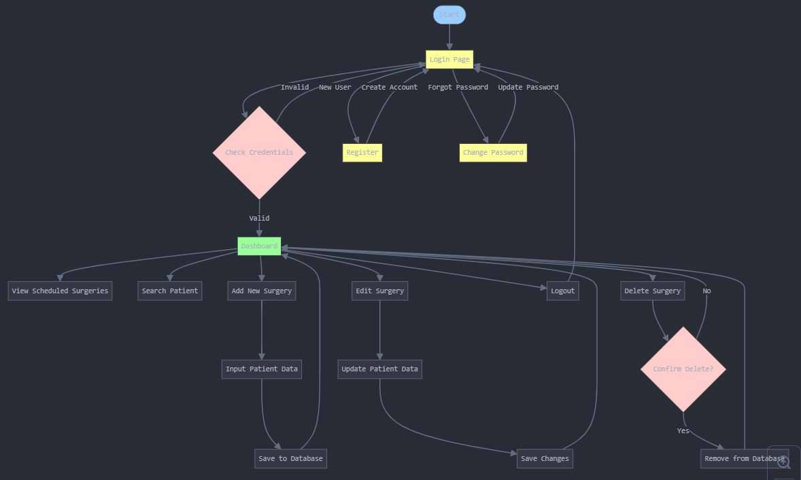

# Nama Aplikasi

Website Penjadwalan Operasi Berdasarkan Tingkat Urgensi

## Kegunaan Aplikasi

Pengaturan penjadwalan operasi berdasarkan tingkat urgensi, yang dapat mengelola data dan jadwal operasi pasien

## Flowchart

Berikut adalah flowchart yang menggambarkan alur kerja aplikasi:

Flowchart alur kerja aplikasi : 

## Perkenalan Tim

Muhammad Ferdiharvan (2213010374) (muhammadferdi90@gmail.com) mengerjakan halaman penjadwalan

Muh Rafly Fatchurrohman (2213010375) (muh.10375@mhs.amikomsolo.ac.id) mengerjakan halaman login, change password, register

Honggo Negoro Seno Sri Satrio (2213010376) (honggo.10376@mhs.amikomsolo.ac.id) mengerjakan halaman login, , change password, register

## Link Video Dokumentasi

Anda dapat menonton video dokumentasi aplikasi melalui tautan berikut:
https://youtu.be/deYlJQOE_3U
